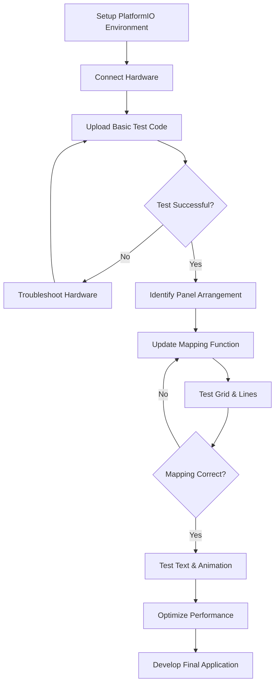

# RGB LED Matrix Project Summary

## Project Overview

This project involves setting up and testing a 4-panel RGB LED matrix display (64x64 LEDs per panel) in a custom arrangement. Based on examining the code and documentation, there are three different implementation approaches:

1. **Arduino Mega Implementation**
   - Uses RGBmatrixPanel library
   - Limited to single Arduino board
   - Basic functionality but limited expandability

2. **Raspberry Pi Pico CircuitPython Implementation**
   - Uses displayio and rgbmatrix libraries
   - More beginner-friendly approach
   - Good for simple projects but may have performance limitations with multiple panels

3. **Raspberry Pi Pico PlatformIO/C++ Implementation** ✅
   - Uses Adafruit_Protomatter library
   - Better performance for multi-panel setups
   - More flexible configuration options
   - Recommended for your 4-panel setup

## Why PlatformIO/C++ Is Recommended

For your 4-panel grid, the PlatformIO/C++ implementation is superior because:

1. **Better Performance**
   - Higher refresh rates
   - More efficient memory usage
   - Lower latency

2. **Multi-Panel Support**
   - Built-in tiling modes
   - Panel count configuration
   - Support for custom arrangements

3. **Greater Flexibility**
   - Bit depth adjustment for performance tuning
   - More control over timing parameters
   - Advanced buffer management

## Test Documentation

We've created several guides to help you set up and test your matrix display:

1. **[testing_plan.md](testing_plan.md)**
   - Basic testing approach
   - Hardware configuration
   - Full-grid testing
   - Performance testing
   - Troubleshooting

2. **[led_matrix_setup_guide.md](led_matrix_setup_guide.md)**
   - PlatformIO setup instructions
   - Panel configuration options
   - Code examples

3. **[custom_panel_mapping.md](custom_panel_mapping.md)**
   - Identifying panel configurations
   - Creating custom mapping functions
   - Common arrangement examples
   - Testing mapping configurations

4. **[performance_testing.md](performance_testing.md)**
   - FPS measurement
   - Memory usage monitoring
   - Performance optimization techniques
   - Test patterns

5. **[matrix_test_code.md](matrix_test_code.md)**
   - Complete working code example
   - Panel identification test
   - Grid and boundary tests
   - Cross-panel drawing tests

## Recommended Testing Process

Follow this process to get your 4-panel display working:

1. **Initial Setup**
   - Install PlatformIO and libraries
   - Connect hardware following pinout in README
   - Power supply should be 5V/4A per panel (16A total)

2. **Basic Tests**
   - Run panel identification test to verify connections
   - Check each panel works individually
   - Verify power is sufficient (no flickering or dimming)

3. **Configuration**
   - Determine your panel arrangement
   - Update mapping function in code
   - Test with grid pattern and cross-panel lines

4. **Advanced Tests**
   - Measure FPS with different content
   - Test with varying bit depths
   - Try different tiling modes if needed

5. **Next Steps**
   - Move to more complex graphics
   - Implement your specific application
   - Fine-tune performance parameters

## Next Steps

Once you've successfully tested your panel setup, you can:

1. **Switch to Code Mode**
   - Implement your specific application
   - Build on the test code provided
   - Add advanced features like animations, images, or dynamic content

2. **Consider Adding:**
   - External input devices (buttons, sensors)
   - Network connectivity for remote control
   - SD card for image/animation storage
   - Sensors for interactive displays

3. **Performance Optimizations:**
   - Adjust bit depth based on your color needs
   - Use double buffering for smoother animations
   - Consider region updates for better performance
   - Optimize memory usage for complex patterns

## Conclusion

With the documentation and code provided, you should be able to get your 4-panel RGB LED matrix display working in your custom arrangement. The PlatformIO/C++ implementation offers the best performance and flexibility for multi-panel setups.

Start with basic tests to ensure everything is connected properly, then move on to more complex graphics and optimizations. The included test code provides a solid foundation to build upon.